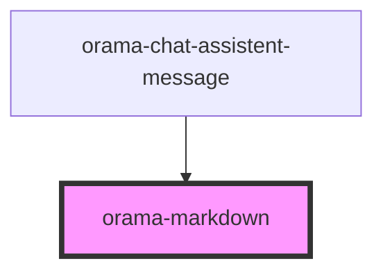

# orama-markdown

<!-- Auto Generated Below -->

## Properties

| Property                 | Attribute                   | Description | Type                                                          | Default     |
| ------------------------ | --------------------------- | ----------- | ------------------------------------------------------------- | ----------- |
| `chatMarkdownLinkHref`   | `chat-markdown-link-href`   |             | `({ text, href }: { text: string; href: string; }) => string` | `undefined` |
| `chatMarkdownLinkTarget` | `chat-markdown-link-target` |             | `({ text, href }: { text: string; href: string; }) => string` | `undefined` |
| `chatMarkdownLinkTitle`  | `chat-markdown-link-title`  |             | `({ text, href }: { text: string; href: string; }) => string` | `undefined` |
| `content`                | `content`                   |             | `string`                                                      | `undefined` |

## Events

| Event                     | Description | Type                                           |
| ------------------------- | ----------- | ---------------------------------------------- |
| `chatMarkdownLinkClicked` |             | `CustomEvent<{ text: string; href: string; }>` |

## Dependencies

### Used by

 - [orama-chat-assistent-message](..)

### Graph

----------------------------------------------

*Built with [StencilJS](https://stenciljs.com/)*
