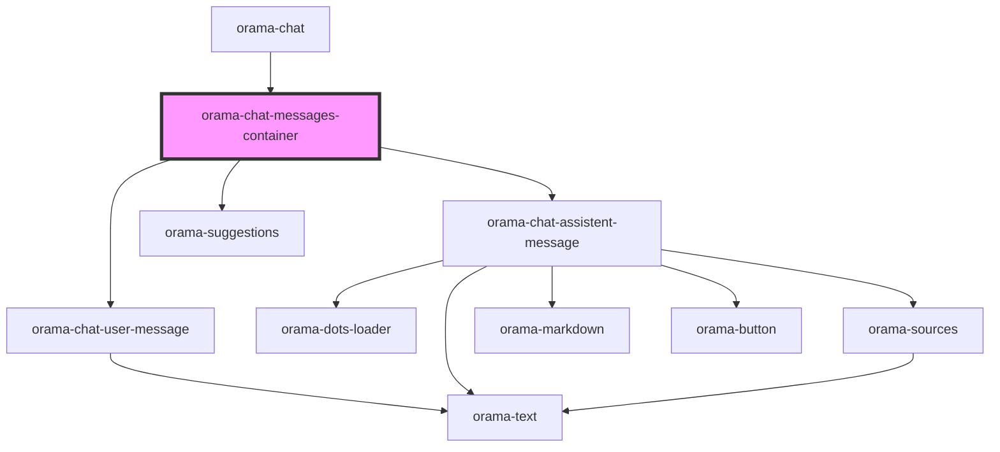

# orama-chat-messages-container

<!-- Auto Generated Below -->

## Properties

| Property                | Attribute | Description | Type                                                          | Default     |
| ----------------------- | --------- | ----------- | ------------------------------------------------------------- | ----------- |
| `chatMarkdownLinkHref`  | --        |             | `({ text, href }: { text: string; href: string; }) => string` | `undefined` |
| `chatMarkdownLinkTitle` | --        |             | `({ text, href }: { text: string; href: string; }) => string` | `undefined` |
| `interactions`          | --        |             | `TChatInteraction[]`                                          | `undefined` |

## Events

| Event             | Description | Type                                                                                                                                             |
| ----------------- | ----------- | ------------------------------------------------------------------------------------------------------------------------------------------------ |
| `answerGenerated` |             | `CustomEvent<{ clientSearchParams: ClientSearchParams; result: { results: SearchResultBySection[]; resultsCount: number; facets: Facet[]; }; }>` |

## Dependencies

### Used by

 - [orama-chat](../orama-chat)

### Depends on

- [orama-chat-user-message](orama-chat-user-message)
- [orama-chat-assistent-message](orama-chat-assistent-message)
- [orama-suggestions](../orama-suggestions)

### Graph

----------------------------------------------

*Built with [StencilJS](https://stenciljs.com/)*
