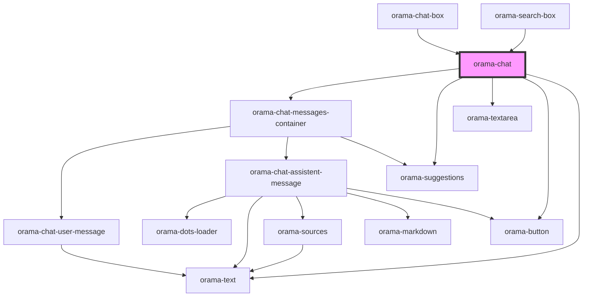

# orama-chat

<!-- Auto Generated Below -->

## Properties

| Property                 | Attribute                   | Description | Type                                                                                                                                                                                                                                                                                                                                                                        | Default                                                     |
| ------------------------ | --------------------------- | ----------- | --------------------------------------------------------------------------------------------------------------------------------------------------------------------------------------------------------------------------------------------------------------------------------------------------------------------------------------------------------------------------- | ----------------------------------------------------------- |
| `chatMarkdownLinkHref`   | `chat-markdown-link-href`   |             | `({ text, href }: { text: string; href: string; }) => string`                                                                                                                                                                                                                                                                                                               | `undefined`                                                 |
| `chatMarkdownLinkTarget` | `chat-markdown-link-target` |             | `({ text, href }: { text: string; href: string; }) => string`                                                                                                                                                                                                                                                                                                               | `undefined`                                                 |
| `chatMarkdownLinkTitle`  | `chat-markdown-link-title`  |             | `({ text, href }: { text: string; href: string; }) => string`                                                                                                                                                                                                                                                                                                               | `undefined`                                                 |
| `clearChatOnDisconnect`  | `clear-chat-on-disconnect`  |             | `boolean`                                                                                                                                                                                                                                                                                                                                                                   | `undefined`                                                 |
| `defaultTerm`            | `default-term`              |             | `string`                                                                                                                                                                                                                                                                                                                                                                    | `undefined`                                                 |
| `dictionary`             | `dictionary`                |             | `{ searchPlaceholder?: string; chatPlaceholder?: string; noResultsFound?: string; noResultsFoundFor?: string; suggestions?: string; seeAll?: string; addMore?: string; clearChat?: string; errorMessage?: string; disclaimer?: string; startYourSearch?: string; initErrorSearch?: string; initErrorChat?: string; chatButtonLabel?: string; searchButtonLabel?: string; }` | `undefined`                                                 |
| `disclaimer`             | `disclaimer`                |             | `string`                                                                                                                                                                                                                                                                                                                                                                    | `'Orama can make mistakes. Please verify the information.'` |
| `focusInput`             | `focus-input`               |             | `boolean`                                                                                                                                                                                                                                                                                                                                                                   | `false`                                                     |
| `linksRel`               | `links-rel`                 |             | `string`                                                                                                                                                                                                                                                                                                                                                                    | `undefined`                                                 |
| `linksTarget`            | `links-target`              |             | `string`                                                                                                                                                                                                                                                                                                                                                                    | `undefined`                                                 |
| `placeholder`            | `placeholder`               |             | `string`                                                                                                                                                                                                                                                                                                                                                                    | `'Ask me anything'`                                         |
| `prompt`                 | `prompt`                    |             | `string`                                                                                                                                                                                                                                                                                                                                                                    | `undefined`                                                 |
| `relatedQueries`         | `related-queries`           |             | `number`                                                                                                                                                                                                                                                                                                                                                                    | `undefined`                                                 |
| `showClearChat`          | `show-clear-chat`           |             | `boolean`                                                                                                                                                                                                                                                                                                                                                                   | `true`                                                      |
| `sourceBaseUrl`          | `source-base-url`           |             | `string`                                                                                                                                                                                                                                                                                                                                                                    | `''`                                                        |
| `sourcesMap`             | `sources-map`               |             | `SourcesMapItem[] \| { path?: string \| SourcesMapRenderFunction; description?: string \| SourcesMapRenderFunction; title?: string \| SourcesMapRenderFunction; } & { datasourceId?: string; }`                                                                                                                                                                             | `undefined`                                                 |
| `suggestions`            | `suggestions`               |             | `string[]`                                                                                                                                                                                                                                                                                                                                                                  | `undefined`                                                 |
| `systemPrompts`          | `system-prompts`            |             | `string[]`                                                                                                                                                                                                                                                                                                                                                                  | `undefined`                                                 |

## Events

| Event               | Description | Type                                                                                                                                 |
| ------------------- | ----------- | ------------------------------------------------------------------------------------------------------------------------------------ |
| `answerGenerated`   |             | `CustomEvent<{ askParams: AskParams; query: string; sources: Results<unknown>; answer: string; segment: string; trigger: string; }>` |
| `clearChat`         |             | `CustomEvent<void>`                                                                                                                  |
| `startConversation` |             | `CustomEvent<{ userPrompt: string; systemPrompts: string[]; }>`                                                                      |

## Dependencies

### Used by

 - [orama-chat-box](../../orama-chat-box)
 - [orama-search-box](../../orama-search-box)

### Depends on

- [orama-chat-messages-container](../orama-chat-messages-container)
- [orama-suggestions](../orama-suggestions)
- [orama-textarea](../orama-textarea)
- [orama-button](../orama-button)
- [orama-text](../orama-text)

### Graph

----------------------------------------------

*Built with [StencilJS](https://stenciljs.com/)*
