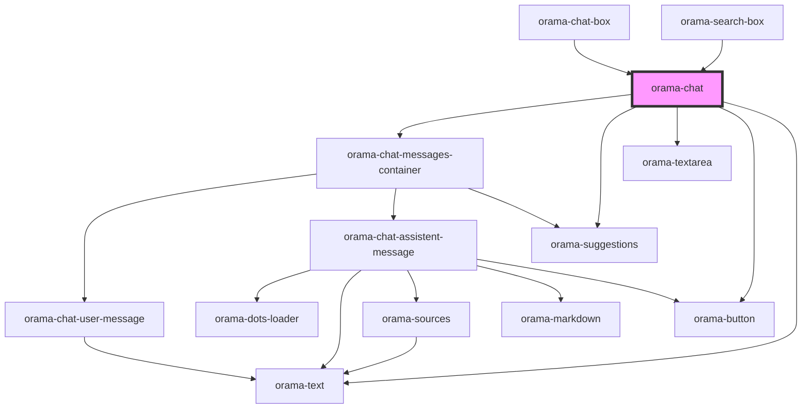

# orama-chat

<!-- Auto Generated Below -->

## Properties

| Property                 | Attribute         | Description | Type                                                          | Default             |
| ------------------------ | ----------------- | ----------- | ------------------------------------------------------------- | ------------------- |
| `chatMarkdownLinkHref`   | --                |             | `({ text, href }: { text: string; href: string; }) => string` | `undefined`         |
| `chatMarkdownLinkTarget` | --                |             | `({ text, href }: { text: string; href: string; }) => string` | `undefined`         |
| `chatMarkdownLinkTitle`  | --                |             | `({ text, href }: { text: string; href: string; }) => string` | `undefined`         |
| `defaultTerm`            | `default-term`    |             | `string`                                                      | `undefined`         |
| `focusInput`             | `focus-input`     |             | `boolean`                                                     | `false`             |
| `linksRel`               | `links-rel`       |             | `string`                                                      | `undefined`         |
| `linksTarget`            | `links-target`    |             | `string`                                                      | `undefined`         |
| `placeholder`            | `placeholder`     |             | `string`                                                      | `'Ask me anything'` |
| `showClearChat`          | `show-clear-chat` |             | `boolean`                                                     | `true`              |
| `sourceBaseUrl`          | `source-base-url` |             | `string`                                                      | `''`                |
| `sourcesMap`             | --                |             | `{ title?: string; path?: string; description?: string; }`    | `undefined`         |
| `suggestions`            | --                |             | `string[]`                                                    | `undefined`         |
| `systemPrompts`          | --                |             | `string[]`                                                    | `undefined`         |

## Events

| Event             | Description | Type                                                                                                                                 |
| ----------------- | ----------- | ------------------------------------------------------------------------------------------------------------------------------------ |
| `answerGenerated` |             | `CustomEvent<{ askParams: AskParams; query: string; sources: Results<unknown>; answer: string; segment: string; trigger: string; }>` |

## Dependencies

### Used by

 - [orama-chat-box](../../orama-chat-box)
 - [orama-search-box](../../orama-search-box)

### Depends on

- [orama-chat-messages-container](../orama-chat-messages-container)
- [orama-suggestions](../orama-suggestions)
- [orama-textarea](../orama-textarea)
- [orama-button](../orama-button)
- [orama-text](../orama-text)

### Graph

----------------------------------------------

*Built with [StencilJS](https://stenciljs.com/)*
