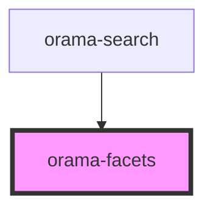

# orama-button

<!-- Auto Generated Below -->

## Properties

| Property               | Attribute        | Description | Type                          | Default     |
| ---------------------- | ---------------- | ----------- | ----------------------------- | ----------- |
| `facets`               | --               |             | `Facet[]`                     | `undefined` |
| `selectedFacet`        | `selected-facet` |             | `string`                      | `undefined` |
| `selectedFacetChanged` | --               |             | `(facetName: string) => void` | `undefined` |

## Dependencies

### Used by

 - [orama-search](../orama-search)

### Graph

----------------------------------------------

*Built with [StencilJS](https://stenciljs.com/)*
