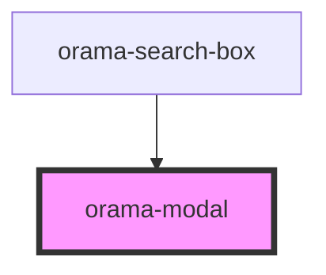

# orama-modal

<!-- Auto Generated Below -->

## Properties

| Property              | Attribute                | Description | Type      | Default |
| --------------------- | ------------------------ | ----------- | --------- | ------- |
| `closeOnEscape`       | `close-on-escape`        |             | `boolean` | `true`  |
| `closeOnOutsideClick` | `close-on-outside-click` |             | `boolean` | `true`  |
| `mainTitle`           | `main-title`             |             | `string`  | `''`    |

## Events

| Event         | Description | Type               |
| ------------- | ----------- | ------------------ |
| `modalClosed` |             | `CustomEvent<any>` |

## Dependencies

### Used by

 - [orama-search-box](../../orama-search-box)

### Graph

----------------------------------------------

*Built with [StencilJS](https://stenciljs.com/)*
