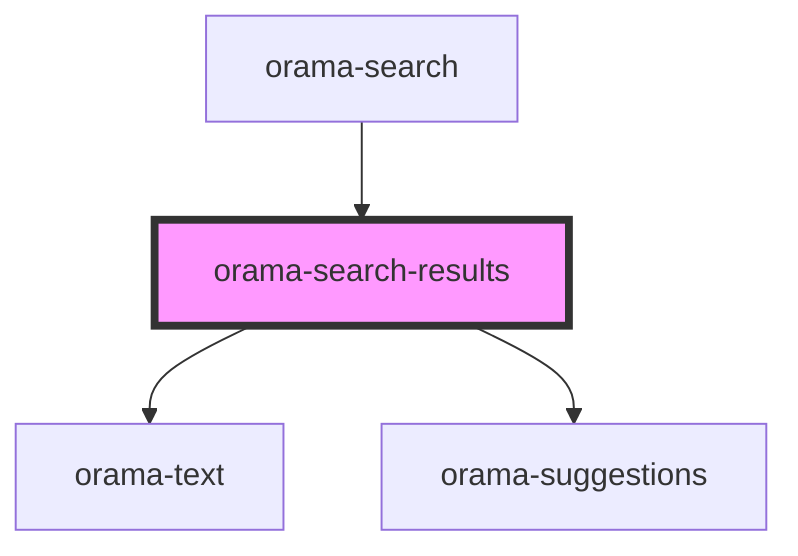

# orama-search-results

<!-- Auto Generated Below -->

## Properties

| Property               | Attribute               | Description | Type                          | Default                 |
| ---------------------- | ----------------------- | ----------- | ----------------------------- | ----------------------- |
| `error`                | `error`                 |             | `boolean`                     | `false`                 |
| `highlightDescription` | `highlight-description` |             | `HighlightOptions \| boolean` | `false`                 |
| `highlightTitle`       | `highlight-title`       |             | `HighlightOptions \| boolean` | `false`                 |
| `linksRel`             | `links-rel`             |             | `string`                      | `'noopener noreferrer'` |
| `linksTarget`          | `links-target`          |             | `string`                      | `'_blank'`              |
| `loading`              | `loading`               |             | `boolean`                     | `false`                 |
| `searchTerm`           | `search-term`           |             | `string`                      | `undefined`             |
| `sections`             | --                      |             | `SearchResultBySection[]`     | `[]`                    |
| `setChatTerm`          | --                      |             | `(term: string) => void`      | `undefined`             |
| `sourceBaseUrl`        | `source-base-url`       |             | `string`                      | `undefined`             |
| `suggestions`          | --                      |             | `string[]`                    | `[]`                    |

## Events

| Event            | Description | Type                                                                             |
| ---------------- | ----------- | -------------------------------------------------------------------------------- |
| `oramaItemClick` |             | `CustomEvent<{ id: string; title: string; description: string; path: string; }>` |

## Dependencies

### Used by

 - [orama-search](../orama-search)

### Depends on

- [orama-text](../orama-text)
- [orama-suggestions](../orama-suggestions)

### Graph

----------------------------------------------

*Built with [StencilJS](https://stenciljs.com/)*
