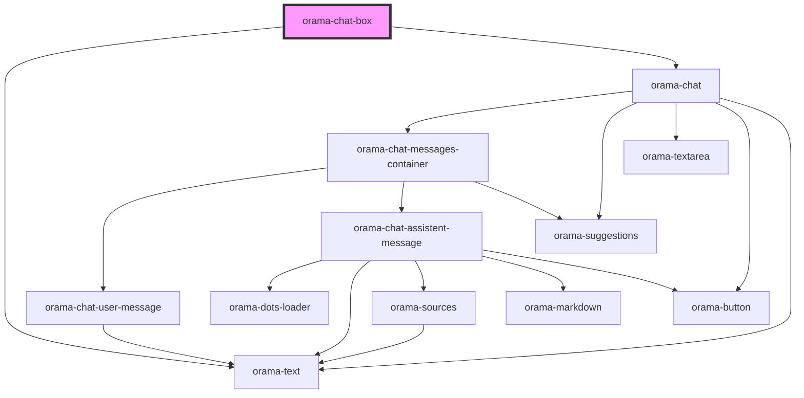

# orama-chat-box

<!-- Auto Generated Below -->

## Properties

| Property                 | Attribute         | Description | Type                                                                                                                                                                                             | Default     |
| ------------------------ | ----------------- | ----------- | ------------------------------------------------------------------------------------------------------------------------------------------------------------------------------------------------ | ----------- |
| `autoFocus`              | `auto-focus`      |             | `boolean`                                                                                                                                                                                        | `true`      |
| `chatMarkdownLinkHref`   | --                |             | `({ text, href }: { text: string; href: string; }) => string`                                                                                                                                    | `undefined` |
| `chatMarkdownLinkTarget` | --                |             | `({ text, href }: { text: string; href: string; }) => string`                                                                                                                                    | `undefined` |
| `chatMarkdownLinkTitle`  | --                |             | `({ text, href }: { text: string; href: string; }) => string`                                                                                                                                    | `undefined` |
| `clientInstance`         | --                |             | `FunctionComponents<any> & Internals<any, AnyIndexStore, AnyDocumentStore, AnySorterStore> & ArrayCallbackComponents<any> & OramaID & { plugins: OramaPlugin<unknown>[]; } \| OramaClient<true>` | `undefined` |
| `index`                  | --                |             | `{ api_key: string; endpoint: string; }`                                                                                                                                                         | `undefined` |
| `linksRel`               | `links-rel`       |             | `string`                                                                                                                                                                                         | `undefined` |
| `linksTarget`            | `links-target`    |             | `string`                                                                                                                                                                                         | `undefined` |
| `placeholder`            | `placeholder`     |             | `string`                                                                                                                                                                                         | `undefined` |
| `sourceBaseUrl`          | `source-base-url` |             | `string`                                                                                                                                                                                         | `undefined` |
| `sourcesMap`             | --                |             | `{ title?: string; path?: string; description?: string; }`                                                                                                                                       | `undefined` |
| `suggestions`            | --                |             | `string[]`                                                                                                                                                                                       | `undefined` |
| `systemPrompts`          | --                |             | `string[]`                                                                                                                                                                                       | `undefined` |

## Events

| Event                     | Description                                            | Type                                                                                                                                 |
| ------------------------- | ------------------------------------------------------ | ------------------------------------------------------------------------------------------------------------------------------------ |
| `answerGenerated`         | Fired when answer generation is successfully completed | `CustomEvent<{ askParams: AskParams; query: string; sources: Results<unknown>; answer: string; segment: string; trigger: string; }>` |
| `answerSourceClick`       | Fired when user clicks on answer source                | `CustomEvent<{ source: SearchResult; }>`                                                                                             |
| `chatMarkdownLinkClicked` | Fired when user clicks on chat markdown link           | `CustomEvent<{ text: string; href: string; }>`                                                                                       |

## Dependencies

### Depends on

- [orama-text](../internal/orama-text)
- [orama-chat](../internal/orama-chat)

### Graph

----------------------------------------------

*Built with [StencilJS](https://stenciljs.com/)*
